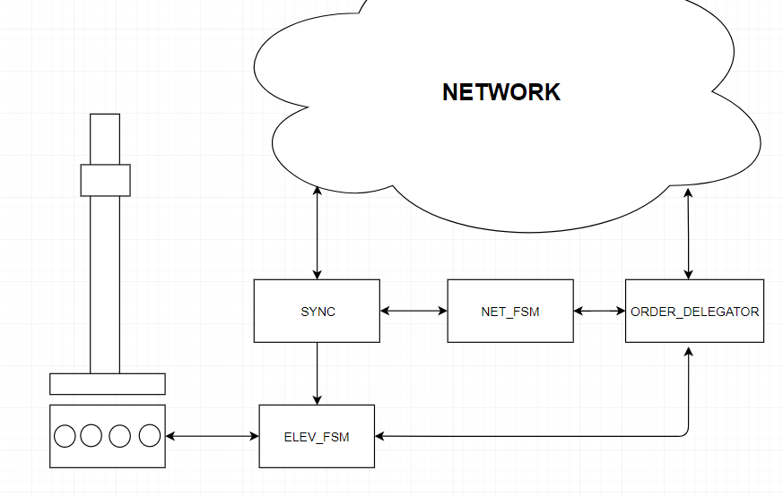

## =========Elevator project TTK4145============
-Lars Mansåker Angelsen , Chris Arun Muralitharan-

This software implements the requirements for the Elevator project for the course TTK4145 Real Time Programming.
It is written in Golang, taking advantage of the languages concurrency features (channels & go routines). The
software is divided into four modules, each with seperate threads and responsibilites. These modules then communicate
using channels.

The software uses the go elevator driver (elevio.go) and the go network modules (bcast.go, localIp.go, and peers.go) given
by the teaching team.

### Module Figure

 
 
### Module description

#### NET FSM
   
   -Has two primary states, master and non-master. 
 
   MASTER:
   
   -Takes in new orders in the network and delegates them to other elevators.
   
   -Synchronizes state with other participants via the SYNC-module.
   
   SLAVE:
   
   -Listens to sync module and is ready to take over as master should master die.
    
#### SYNC

   -Enables synchronization between NET-FSM modules.
   
#### ORDER HANDLER

   -Shares orders through the network. New order orders and finished orders go through this module.
   
   -Is resiliant to packetloss by trying several times and waiting for ACK.
   
#### ELEV FSM

   -Controls the elevator via the go-driver.
   
   -Reads button input and sends them to order handler / acts on them.
