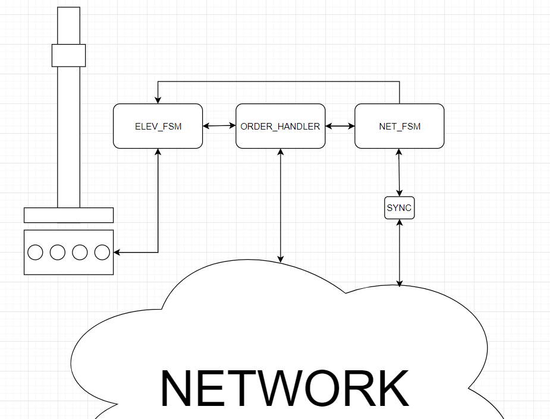

=========Elevator project TTK4145============
 -Lars M. Angelsen , Chris Arun Muralitharan-

This software implements the requirements for the Elevator project for the course TTK4145 Real Time Programming.
It is written in Golang, taking advantage of the languages concurrency features (channels & go routines). The
software is divided into four modules, each with seperate threads and responsibilites. These modules then communicate
using channels.

The software uses the go elevator driver (elevio.go) and the go network modules (bcast.go, localIp.go, and peers.go) given
by the teaching team.

